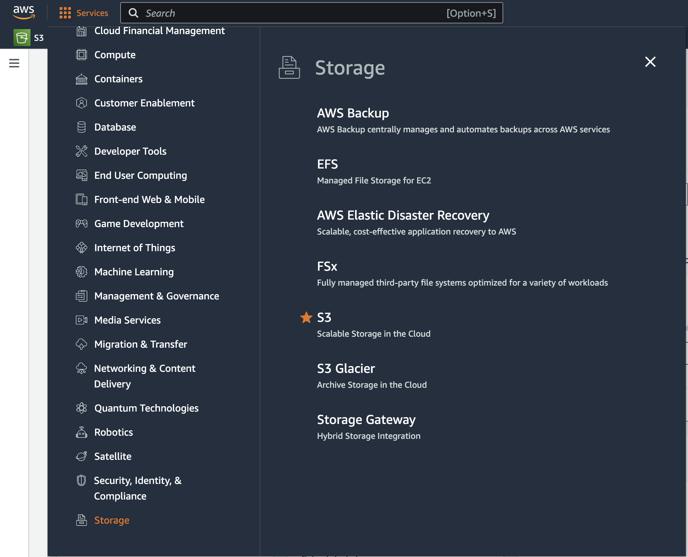
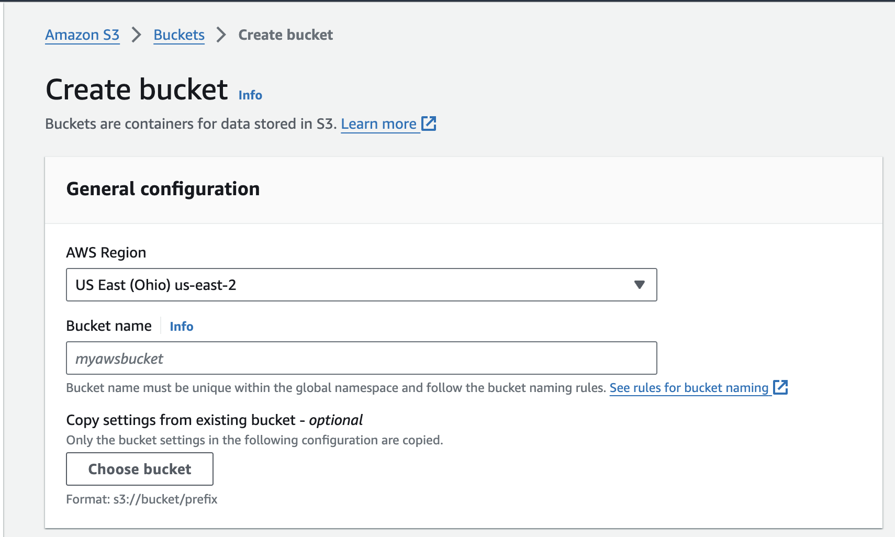
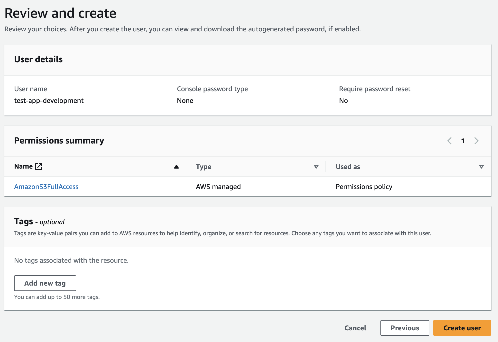
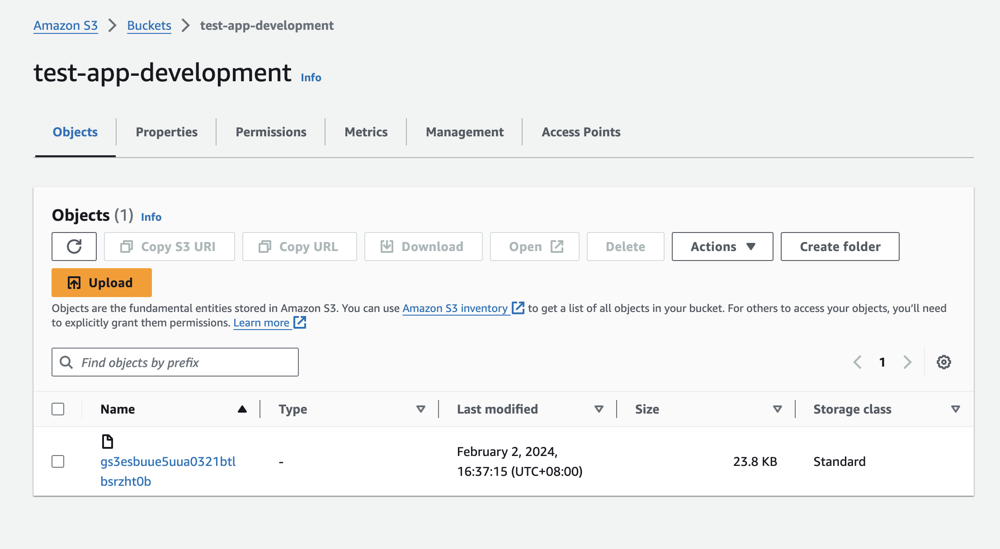

# Image Uploads with Ruby on Rails, Active Storage, and Amazon AWS S3

This tutorial provides a detailed guide on integrating image uploads in a Ruby on Rails application using Active Storage and Amazon AWS S3. Understanding the management of BLOBs (Binary Large Objects) is crucial for this setup, as it forms the foundation of handling large data files like images, audio, and video efficiently.

## Introduction to BLOBs

BLOBs, or Binary Large Objects, refer to large data items such as images, audio files, or any type of multimedia files that are typically stored in binary format. Unlike traditional text-based data, which is easily stored and managed in standard database fields, BLOBs require special handling due to their size and binary nature.

### Why Store BLOBs Differently:

1. **Size and Scalability**: BLOBs can be very large, often exceeding the size limits of standard database fields. Storing them directly in a database can rapidly inflate the size of the database and degrade performance.
   
2. **Efficiency**: Databases are optimized for operations on structured, textual data. Binary data storage and retrieval operations can be less efficient when handled directly by the database.
   
3. **Cost and Complexity**: Large BLOBs can contribute to increased costs for database storage and backup. Separating BLOB storage from the database can reduce costs and simplify data management.

4. **Serving Media**: Serving large files directly from a database can be inefficient. Using dedicated services like AWS S3 for storing and serving BLOBs can provide better performance and scalability.

With these considerations in mind, let's explore how to implement a robust and scalable solution for handling BLOBs in Ruby on Rails using Active Storage and Amazon AWS S3.

## Setting Up Active Storage with Amazon S3

### Install Active Storage
Run these commands to install Active Storage and migrate your database:

```bash
rails active_storage:install
rails db:migrate
```

<aside>
Active Storage uses 3 tables.

`active_storage_attachments`: Links blobs to your models
`active_storage_blobs`: Contains metadata for uploaded files, such as filenames and content types.
`active_storage_variant_records`: Tracks image variants, if enabled.
</aside>

### Choose Your Cloud Storage
Although we focus on AWS S3 (simple storage service) for its affordability and scalability, Active Storage supports various storage services. Refer to [AWS S3 pricing]((https://aws.amazon.com/s3/pricing/)) for cost details.

### Add the AWS SDK Gem
Let's add the [AWS SDK Gem](https://rubygems.org/gems/aws-sdk-s3/)
Add this line to your Gemfile:

```ruby
gem 'aws-sdk-s3', require: false
```

Then, run `bundle install`.

### Set Up an AWS S3 Bucket

1. [Sign up for an AWS account](https://aws.amazon.com/).

2. Create an S3 Bucket
In the AWS Management Console, go to the [S3 service](https://s3.console.aws.amazon.com/s3) and create a new bucket.



You can keep the default recommended settings. The 2 settings you'll need to set are name (eg `my-app-name-development`) and region (eg `us-east-2`).

Recommendation: Use a naming convention that includes your environment (development, production) for easier management. This way you can easily identify production, development, and test environments. Later on we'll be able to set the bucket name dynamically in our code like this `your-app-name-<%= Rails.env %>`.



3. Configure IAM for Security

IAM is a security tool to configure who has access to your resources. In the [IAM dashboard](https://us-east-1.console.aws.amazon.com/iam/), [create a new user](https://us-east-1.console.aws.amazon.com/iam/home#/users/create) with username (eg `my-app-name-development`) and programmatic access. Attach the “AmazonS3FullAccess” policy or a custom policy.




We'll need to create a access key ID and secret access key for this IAM user so your application can access the bucket as this user. On the users page click "create access key" and take a note of the "access key" and "secret access key". You'll need to do this step again if you lose the "secret access key".


<aside>
It is considered an AWS best practice to grant permissions to a "user group" and then add users to the group. This is especially helpful when managing permissions for many users at larger organizations.
</aside>

<aside>
If your application needs to access the S3 bucket from a different domain, you'll need to set up CORS.

In the S3 dashboard, click on your bucket.

Go to the “Permissions” tab.

Scroll down to “Cross-origin resource sharing (CORS).”

Click “Edit” and add a CORS policy. Example for a general setup:

```json
[
  {
    "AllowedHeaders": ["*"],
    "AllowedMethods": ["GET", "POST", "PUT", "DELETE", "HEAD"],
    "AllowedOrigins": ["*"],
    "ExposeHeaders": []
  }
]
```
Click “Save changes.”
</aside>

### Integrate S3 with Rails
Add the S3 credentials to your Rails credentials file. In the terminal run:

```bash
EDITOR="code --wait" rails credentials:edit
```

<aside>
If you're using a codespace, make sure to keep a copy of your `master.key` somewhere since it's not tracked with version control.
</aside>

And then add your AWS credentials.

```yaml
aws:
  access_key_id: YOUR_ACCESS_KEY_ID
  secret_access_key: YOUR_SECRET_ACCESS_KEY
```

Configure S3 Service
In config/storage.yml, set up the AWS S3 service to use your credentials:

```yaml
amazon:
  service: S3
  access_key_id: <%= Rails.application.credentials.dig(:aws, :access_key_id) %>
  secret_access_key: <%= Rails.application.credentials.dig(:aws, :secret_access_key) %>
  region: us-east-2 # set to your region
  bucket: your-app-name-<%= Rails.env %>
```

In `config/environments/development.rb` (and `production.rb`), set Active Storage to use S3 in production:

```ruby
config.active_storage.service = :amazon
```

### Attach File to a Model
In your model (e.g., `app/models/user.rb`):

```ruby
class User < ApplicationRecord
  has_one_attached :avatar
end
```

<!-- TODO: explain how this works in the table -->

### Update Form for File Upload
In your form view:

```erb
<%= form_with model: @user, local: true do |form| %>
  <%= form.file_field :avatar %>
  <%= form.submit %>
<% end %>
```

<!-- TODO: explain how this is rendered in html -->

```html
<form enctype="multipart/form-data" action="/users" accept-charset="UTF-8" method="post"><input type="hidden" name="authenticity_token" value="ED5XJBGQt1zpFXgFyAajER_Z-3sVAwb5SKYpdUShNDGYFTZN9RFtmhdNhGR9SWiuoGxcAeMMHdCn32CEmEeatA" autocomplete="off" />

  <div>
    <input type="file" name="user[avatar]" id="user_avatar" />
  </div>

  <div>
    <input type="submit" name="commit" value="Create User" data-disable-with="Create User" />
  </div>
</form>
```

### Handle File Upload in Controller
In your controller, permit the file parameter:

```ruby
def user_params
  params.require(:user).permit(:avatar)
end
```

<aside>
   If you're adding an avatar to a Devise user you may need to override the default [Strong Parameters](https://github.com/heartcombo/devise?tab=readme-ov-file#strong-parameters). Something like this:
```ruby
class ApplicationController < ActionController::Base
  before_action :configure_permitted_parameters, if: :devise_controller?

  protected

  def configure_permitted_parameters
    devise_parameter_sanitizer.permit(:account_update, keys: [:password, :password_confirmation, :current_password, :avatar])
  end
end
```
</aside>

### Display the Upload
In your view file:

```erb
<%= image_tag user.avatar if user.avatar.attached? %>
```

<!-- TODO: explain how source url is generated -->
```html
<div id="user_1">
  
</div>
```

When you attach a file to a record, it will be uploaded and safely stored in your AWS bucket.



## Attaching Images in Sample Data Task
You can use the `faker` gem to generate avatar image urls for your sample data: you'll  generate a url, download the data, then attach it to your record.

```ruby
# library to open an http, https or ftp URL as though it were a file
require 'open-uri'

# Use Faker to get an avatar URL
# eg "https://robohash.org/perspiciatisquisit.png?size=300x300&set=set1"
avatar_url = Faker::Avatar.image

# Download the avatar image
avatar_image = URI.open(avatar_url)

# Attach the avatar image to the user
user.avatar.attach(io: avatar_image, filename: 'avatar.jpg', content_type: 'image/jpg')
```

You can also use [Faker::LoremFlickr.image](https://github.com/faker-ruby/faker/blob/main/doc/default/lorem_flickr.md) to get sample images from [Flickr](https://www.flickr.com/).

## Conclusion
This guide covered setting up image uploads in Ruby on Rails using Active Storage and Amazon AWS S3. Remember to keep your AWS credentials secure and manage permissions carefully for security.

Additional Resources
- [Active Storage Overview](https://guides.rubyonrails.org/active_storage_overview.html)
- [AWS SDK for Ruby](https://aws.amazon.com/sdk-for-ruby/)
- [AWS S3 Documentation](https://docs.aws.amazon.com/s3/)
- FTP Clients (File Transfer Protocol)
   - [Commander One](https://ftp-mac.com/)
   - [Cyberduck](https://cyberduck.io/)
